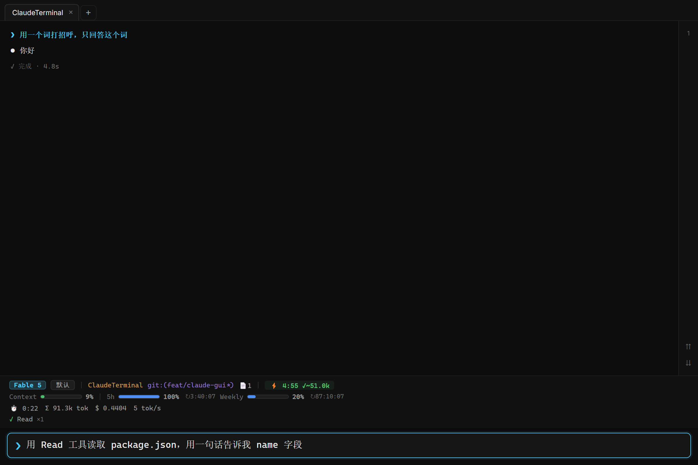

# ClaudeTerminal

**A chat-style desktop GUI for Claude Code.**

ClaudeTerminal renders your Claude Code sessions as a single chat-style message stream with terminal aesthetics — plus the things a raw terminal can't give you: real block folding, multi-tab concurrent sessions, a rich status HUD with a prompt-cache timer, and a floating "dynamic island" companion window.

## Download

Grab the latest **`ClaudeTerminal-Setup-x.y.z.exe`** from the [**Releases**](../../releases) page, run it, done. The app auto-updates from here.

> Windows SmartScreen may warn because the installer isn't code-signed yet. Click **More info → Run anyway** if you trust the source.

## Requirements

- **Windows 10/11 x64**
- **[Claude Code](https://claude.com/claude-code) installed and logged in** — ClaudeTerminal drives the official `@anthropic-ai/claude-agent-sdk` and reuses your Claude Code authentication. It runs on *your own* Claude login and quota; no extra API key needed.

## Features

- **Chat-style message stream** — every turn, tool call, and thinking block is a structured card, not raw ANSI text
- **Real folding** — collapse/expand tool calls and thinking blocks; state persists per block
- **Multi-tab sessions** — independent concurrent Claude Code sessions, each with its own working directory and permission mode; resume from history
- **Status HUD** — model, permission mode, git branch, context/quota bars, session stats (tokens, cost, tok/s), and a **prompt-cache timer**
- **Dynamic island** — an optional always-on-top mini window mirroring session state, with an optional pixel pet
- **Interactive cards** — permission prompts, AskUserQuestion choices, plan approval, engine-error recovery — all real UI
- **Rewind** — double-tap Esc to roll back to an earlier turn
- **Quality of life** — full-session search, Markdown export, outline navigation, file-changes & background-tasks panels, image paste, `!` local commands, `/` slash-command completion
- **8 themes** (4 palettes × light/dark) and live Chinese/English UI switching

## Key shortcuts

**Enter** send · **Shift+Enter** newline · **Esc** interrupt · **Shift+Tab** cycle permission mode · **Ctrl+↑/↓** jump between turns · double-tap **Esc** rewind · **Ctrl+F** search · **Ctrl+S** export Markdown · **Ctrl+O** outline · **Ctrl+G** file changes · **Ctrl+B** background tasks

## About this repository

This repository hosts the **binary releases** for ClaudeTerminal. New installers are published here so the app's built-in auto-updater can fetch new versions automatically.

## License

[MIT](./LICENSE)
